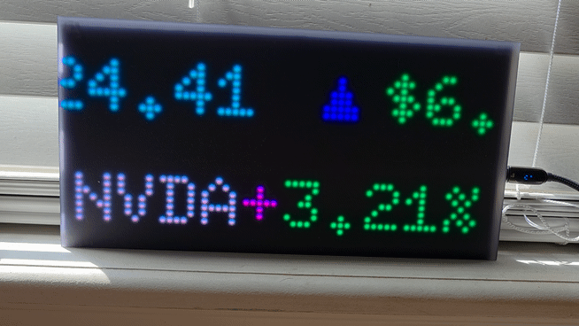

# CircuitPython Matrix Stock Ticker

A scrolling stock ticker built for a CircuitPython RGB LED matrix. Displays
stock name, current price, dollar change, and percent change with color
coding and arrow indicators for market performance.



## Features

- Display scrolling stock price and performance indicators (dollar and percent change since day opening)
- Color-coded direction: green for gains and red for losses
- Smooth fade transition between stocks
- Configurable repeat count (each stock scrolls N times before advancing)
- Stock API to pull up-to-date stock quotes at regular intervals

## Hardware

| Component | Model |
|---|---|
| Microcontroller board | [Adafruit MatrixPortal S3](https://learn.adafruit.com/adafruit-matrixportal-s3)
| LED matrix panel | [64x32 LED Matrix RGB](https://www.adafruit.com/product/2278)
| Power supply | 5V 4A

## Software / Dependencies

- CircuitPython version: *(e.g. 9.x)*
- Required libraries (copy into `/lib` on `CIRCUITPY` drive):
  - `adafruit_matrixportal`
  - `adafruit_display_text`
  - `adafruit_bitmap_font`

## Fonts

Place `.bdf` font files in `/fonts` on the `CIRCUITPY` drive.


## Configuration

Edit values in `code.py`:

```python
STOCKS = ["AAPL", "MSFT", "GOOGL", "TSLA"]   # symbols to display, in order

MIN_SECONDS_BETWEEN_CALLS = 1.5   # spacing between individual API calls
DATA_INTERVAL = 60                # seconds between full data refreshes
DAILY_CALL_LIMIT = 500            # daily API call cap (adjust to your plan)

REPEATS_PER_QUOTE = 3             # scroll passes per stock before advancing
SCROLL_SPEED = 0.03               # seconds per pixel-step (lower = faster)
FADE_STEPS = 10                   # steps in the fade transition
FADE_DELAY = 0.02                 # seconds per fade step
```

### Wi-Fi credentials

Add your network credentials to `secrets.py` on the `CIRCUITPY` drive:

```python
secrets = {
    "ssid": "YOUR_WIFI_NAME",
    "password": "YOUR_WIFI_PASSWORD",
    "finnhubio_token": "YOUR_API_KEY",
}
```

## Setup

1. Install CircuitPython on the board (see [circuitpython.org](https://circuitpython.org)).
2. Copy the required libraries into `/lib`.
3. Copy `.bdf` font files into `/fonts`.
4. Create `secrets.py` with your Wi-Fi credentials and API key.
5. Copy `code.py` to the root of the `CIRCUITPY` drive.
6. Adjust `STOCKS` in `code.py`.
7. Reset the board — the ticker should boot and begin displaying.

## API Provider Notes

- Provider: *Finnhub*
- Response fields used: *(e.g. `c` = current price, `d` = change, `dp` = percent change)*

## Reference
- [MatrixPortal S3](https://circuitpython.org/board/adafruit_matrixportal_s3)
- [Finnhub](https://finnhub.io/docs/api)